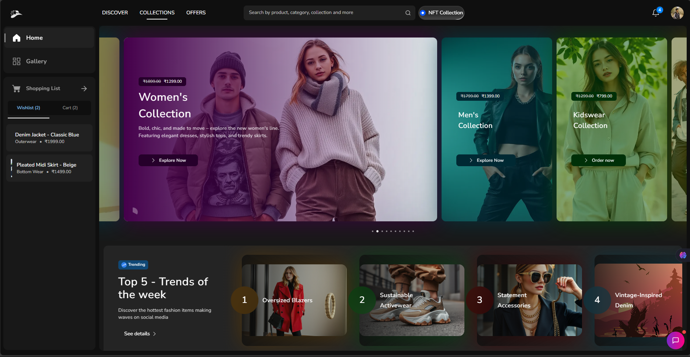
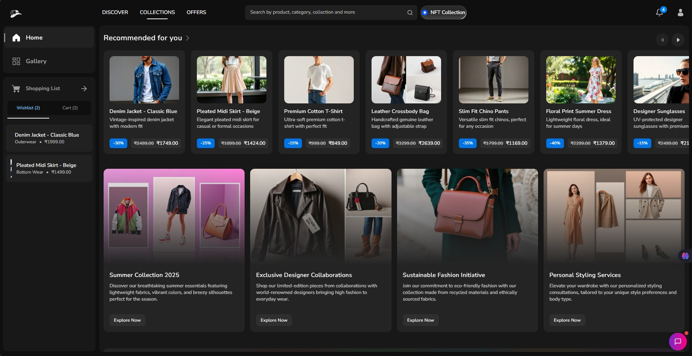
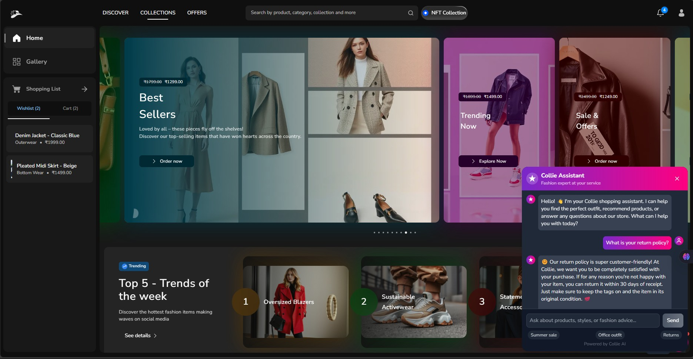

# 🛍️ Collie | AI-Powered Fashion E-Commerce

<div align="center">
  
  <p><em>Fashion Redefined with AI-Powered Recommendations</em></p>
  
  [](https://nextjs.org/)
  [](https://www.typescriptlang.org/)
  [](https://mui.com/)
  [](https://firebase.google.com/)
  [](https://www.mongodb.com/)
  [](https://ethereum.org/)
</div>

## 📱 Application Preview

<div align="center">
  <table>
    <tr>
      <td><strong>Home Page</strong></td>
      <td><strong>Product Collections</strong></td>
      <td><strong>AI Assistant</strong></td>
    </tr>
    <tr>
      <td></td>
      <td></td>
      <td></td>
    </tr>
  </table>
</div>

## ✨ Key Features

### 🤖 AI-Powered Shopping Assistant

Collie's AI shopping assistant helps users find perfect fashion items based on their preferences, style, and budget. It provides personalized recommendations and styling advice using advanced natural language processing.

### 🎯 Personalized Fashion Experience

- **Style Profiling**: Users can create profiles with their style preferences, sizes, and favorite colors
- **Smart Recommendations**: Algorithm-based product suggestions tailored to each user
- **Virtual Try-On**: Experimental feature allowing users to visualize outfits

### 💳 Seamless Shopping Experience

- **Secure Authentication**: Firebase authentication with multiple providers
- **Shopping Cart**: Real-time cart management with MongoDB integration
- **Checkout Process**: Streamlined, user-friendly checkout flow
- **Order Tracking**: Comprehensive order management system

### ⛓️ Web3 Integration

- **Crypto Payments**: Accept cryptocurrencies for purchases
- **NFT Collectibles**: Exclusive digital fashion collectibles
- **Blockchain Verification**: Verify authenticity of premium products
- **Wallet Connect**: Easy integration with popular crypto wallets
- **Loyalty Tokens**: Earn and spend tokens in the Collie ecosystem

### 🎨 Premium UI/UX Design

- **Responsive Design**: Perfectly optimized for all devices
- **Dark/Light Mode**: User-selectable themes
- **Motion Effects**: Subtle animations enhance the shopping experience
- **Accessibility**: WCAG compliance for inclusive shopping

## 🛠️ Technology Stack

### Frontend

- **Next.js 15**: App router, server components, and server actions
- **React 19**: Latest React features with hooks and functional components
- **Material UI 6**: Custom-themed components with CSS variables
- **TypeScript**: Strong typing for enhanced code quality
- **Framer Motion**: Smooth animations and transitions

### Backend

- **Firebase**: Authentication, storage, and real-time database
- **MongoDB**: Product database and user profiles
- **Next.js API Routes**: Serverless functions for backend operations
- **Groq API**: AI assistant integration for product recommendations

### Web3 Infrastructure

- **Wagmi**: React hooks for Ethereum
- **Ethers.js**: Ethereum library for interacting with the blockchain
- **Web3Modal**: Connect to multiple wallets
- **Coinbase Wallet SDK**: Integration with Coinbase Wallet
- **Viem**: TypeScript interface for Ethereum

### Infrastructure

- **Vercel**: Deployment and hosting
- **Mongoose**: MongoDB object modeling
- **Zustand**: State management
- **TailwindCSS**: Utility-first CSS framework for custom styling

## 🚀 Getting Started

### Prerequisites

- Node.js 18+
- npm or yarn
- MongoDB account
- Firebase project
- Metamask or other Web3 wallet (optional for Web3 features)

### Installation

1. Clone the repository:

```bash
git clone https://github.com/yourusername/collie.git
cd collie
```

2. Install dependencies:

```bash
npm install
# or
yarn
```

3. Set up environment variables:
   Create a `.env.local` file with the following variables:

```
NEXT_PUBLIC_FIREBASE_API_KEY=your_firebase_api_key
NEXT_PUBLIC_FIREBASE_AUTH_DOMAIN=your_firebase_auth_domain
NEXT_PUBLIC_FIREBASE_PROJECT_ID=your_firebase_project_id
NEXT_PUBLIC_FIREBASE_STORAGE_BUCKET=your_firebase_storage_bucket
NEXT_PUBLIC_FIREBASE_MESSAGING_SENDER_ID=your_firebase_messaging_sender_id
NEXT_PUBLIC_FIREBASE_APP_ID=your_firebase_app_id
NEXT_PUBLIC_GROQ_API_KEY=your_groq_api_key
MONGODB_URI=your_mongodb_uri
WALLET_CONNECT_PROJECT_ID=your_wallet_connect_project_id
```

4. Run the development server:

```bash
npm run dev
# or
yarn dev
```

5. Open [http://localhost:3000](http://localhost:3000) in your browser.

## Web3 Features Guide

### Connecting Your Wallet

1. Click on the wallet icon in the navigation bar
2. Select your preferred wallet provider (MetaMask, WalletConnect, Coinbase)
3. Approve the connection request in your wallet

### NFT Collectibles

- Browse exclusive digital fashion items in the NFT Collection section
- Each purchase includes a digital twin as an NFT
- View your NFT collection in the profile section

### Crypto Payments

- At checkout, select "Pay with Crypto" option
- Choose from supported cryptocurrencies (ETH, USDC, DAI)
- Confirm transaction in your connected wallet

## 🔧 Performance Optimizations

- **Image Optimization**: Next.js image optimization with WebP format
- **Code Splitting**: Automatic code splitting for faster page loads
- **Server-Side Rendering**: Pre-rendered pages for improved SEO and performance
- **Incremental Static Regeneration**: Updated content without rebuilding the entire site

## 🌟 Future Enhancements

- [ ] **AR Try-On**: Augmented reality try-on experience
- [ ] **Social Shopping**: Share outfits and recommendations with friends
- [ ] **Loyalty Program**: Rewards and points system for repeat customers
- [ ] **Voice Search**: Find products using voice commands
- [ ] **Personalized Email Marketing**: Tailored recommendations via email
- [ ] **DAO Governance**: Community-driven product decisions
- [ ] **Decentralized Identity**: Self-sovereign identity for users

## 📊 Analytics & Insights

Collie includes comprehensive analytics to understand user behavior:

- Shopping patterns and preferences
- Conversion funnel optimization
- A/B testing framework for UI/UX improvements
- Heat mapping for user interaction analysis

## 📱 Progressive Web App

Collie is also available as a Progressive Web App:

- Offline functionality
- Home screen installation
- Push notifications for order updates
- Fast loading speeds

## 🤝 Contributing

Contributions are welcome! Please read our [contributing guidelines](CONTRIBUTING.md) to get started.

## 📄 License

This project is licensed under the MIT License - see the [LICENSE](LICENSE) file for details.

## 🙏 Acknowledgements

- [Material UI](https://mui.com/) for the excellent component library
- [Firebase](https://firebase.google.com/) for authentication and storage solutions
- [MongoDB](https://www.mongodb.com/) for the database infrastructure
- [Groq](https://groq.com/) for AI assistant capabilities
- [WalletConnect](https://walletconnect.com/) for Web3 wallet integration
- [Wagmi](https://wagmi.sh/) for React hooks for Ethereum
- All the open-source contributors whose libraries made this project possible

---

<div align="center">
  <p>Made with ❤️ by the Collie Team</p>
  <p>
    <a href="https://twitter.com/collie_fashion">Twitter</a> •
    <a href="https://www.instagram.com/collie_fashion">Instagram</a> •
    <a href="https://www.linkedin.com/company/collie-fashion">LinkedIn</a>
  </p>
</div>
